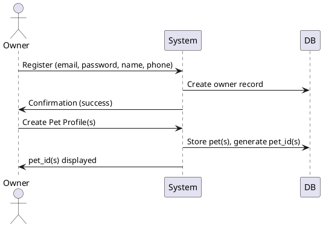
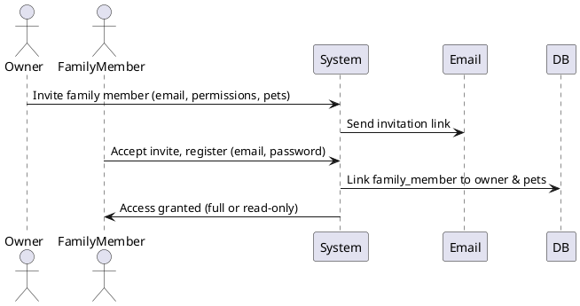
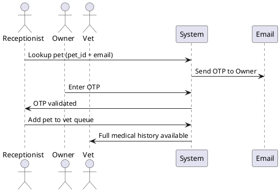
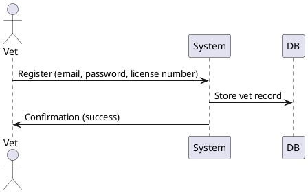
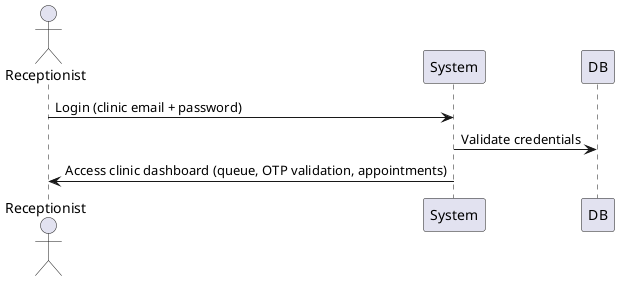

# Technical Requirements Document (TRD) – User Onboarding

## 1. Introduction

This TRD defines the onboarding requirements and flows for different user roles in the Pet Medical Record System. The roles covered are:

- Pet Owner
- Family Member
- Clinic (Receptionist)
- Vet (Doctor)
- Receptionist

The goal is to ensure a secure and smooth onboarding process for each role, aligned with the system’s core objectives.

---

## 2. User Onboarding Journeys

### 2.1 Pet Owner
- **Login**: Email + password.
- **Flow**:
  1. Register with email, password, name, and phone number.
  2. Create one or more pet profiles.
  3. Each pet gets a unique `pet_id`.
  4. Owner can invite family members to help manage pets.
- **Notes**:
  - Pet owner is always the “root” account holder.
  - Owner can manage multiple pets.

---

### 2.2 Family Member
- **Relationship**: Linked under pet owner’s account.
- **Flow**:
  1. Pet owner invites family member via email.
  2. Family member registers with their own email + password.
  3. Permissions are set by owner at invite time:
     - **Full access**: Add/edit/manage pets.
     - **Read-only**: View only.
  4. Family member gains access only to the pets specified by the owner.
- **Notes**:
  - Family members are full users but tied to an owner.
  - They can manage multiple pets if allowed.

---

### 2.3 Clinic
- **Onboarding**: Registered in system by admin (name, address, phone, email).
- **Flow during visit**:
  1. Pet owner/family provides **pet_id + email** at clinic.
  2. System sends OTP to owner/family email.
  3. Receptionist enters OTP for validation.
  4. Once verified, clinic can add the pet to doctor’s queue.
  5. Assigned vet gains full medical history access (initial version).
- **Notes**:
  - Owners/family can mark clinic as **trusted**, which bypasses OTP for future visits.
  - Receptionists share one account in initial version.
  - No receptionist audit logging in this phase.

---

### 2.4 Vet (Doctor)
- **Onboarding**:
  - Independent sign-up with email, password, license number, and name.
  - May associate with clinics but can also work as freelancers.
- **Flow**:
  1. Vet is assigned to pet when receptionist adds pet to queue.
  2. Vet gains full medical history access (not time-bound in initial version).
  3. Vet can add new records to medical timeline.
- **Notes**:
  - Vets do not have a consolidated cross-clinic dashboard yet.

---

### 2.5 Receptionist
- **Onboarding**:
  - Uses shared clinic account (email + password).
- **Flow**:
  - Login with shared credentials.
  - Look up pets, validate OTP from owner/family email, schedule appointments, assign vet.
- **Notes**:
  - No per-user receptionist accounts in this phase.
  - No audit log per receptionist in this phase.

---

## 3. User Stories

### Pet Owner
- As a pet owner, I want to register with my email and password so that I can create and manage my pet profiles.
- As a pet owner, I want to invite family members via email so that they can help manage my pet(s).

### Family Member
- As a family member, I want to log in with my own email and password so that I can access the pets shared with me.

### Clinic
- As a clinic receptionist, I want to look up a pet by ID and validate access with OTP so that the vet can see full medical history.
- As a pet owner, I want to mark a clinic as trusted so that future visits don’t require OTP validation.

### Vet
- As a vet, I want to register independently so that I can be assigned to pets even as a freelancer.
- As a vet, I want to access the pet’s full history once assigned so that I can provide informed care.

### Receptionist
- As a receptionist, I want to log in with the clinic’s shared account so that I can manage queues and OTP validation.

---

## 4. Flow Diagrams

### 4.1 Pet Owner Onboarding

### 4.2 Family Member Invitation

### 4.3 Clinic Visit

### 4.4 Vet Registration

### 4.5 Receptionist Login

---

## 5. Constraints
- Pet owner and family member login must be via **email + password**.
- Clinic access requires OTP validation unless trusted.
- Receptionists use shared accounts in this phase.
- No receptionist-level audit logging initially.
- Vets have full history access once assigned.

---

## 6. Assumptions
- Owners will drive family invitations and clinic trust settings.
- OTPs will be sent via email.
- Clinics have reliable internet access.
- Data privacy regulations are followed (e.g., GDPR, CCPA).

---

## 7. Future Enhancements
- Individual receptionist accounts with audit trails.
- Time-bound vet access (e.g., 1 month per assignment).
- Cross-clinic dashboards for vets.
- Pet-specific permissions for family members.
- Multi-factor authentication for sensitive operations.

---

**End of Document**
